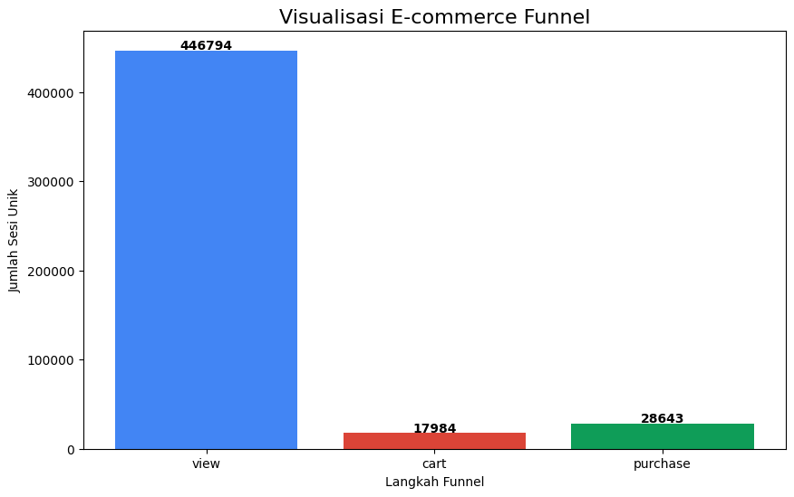

# Analisis Funnel E-Commerce
> Proyek ini menganalisis data perilaku pengguna dari sebuah toko e-commerce dan menemukan anomali data yang mengungkap insight penting tentang jalur pembelian pelanggan.

## 1. Tujuan Proyek
Tujuan awalnya adalah untuk menganalisis *conversion rate* (tingkat konversi) pada *funnel* penjualan tradisional: **View -> Cart -> Purchase**.

## 2. Alat & Teknologi
* **Python**
* **Pandas** (Untuk manipulasi & analisis data)
* **Matplotlib** (Untuk visualisasi data)
* **Google Colab** (Lingkungan pengerjaan)

## 3. Dataset
Data yang digunakan adalah [eCommerce behavior data](https://www.kaggle.com/datasets/mkechinov/ecommerce-behavior-data-from-multi-category-store) dari Kaggle, menggunakan 10 juta baris pertama dari file `2019-Oct.csv`.

## 4. Visualisasi & Temuan Kunci
Analisis *funnel* tradisional menghasilkan sebuah anomali yang signifikan:

**Temuan Kunci (Insight):**

* Jumlah sesi unik **'Purchase' (28.643)** secara signifikan **LEBIH TINGGI** daripada jumlah sesi unik **'Cart' (17.984)**.
* Ini mematahkan asumsi *funnel* tradisional. Secara logika, ini tidak mungkin terjadi jika *setiap* pembelian harus melalui *cart*.
* Data "Konversi Cart -> Purchase" (159.27%) tidak valid dan menunjukkan adanya jalur pembelian lain.

## 5. Hipotesis & Rekomendasi Bisnis

**Hipotesis (Penyebab Anomali):**
Penjelasan paling logis adalah adanya **jalur pembelian alternatif** yang sangat dominan, yaitu tombol **"Beli Sekarang" (Buy Now)**. Jalur ini memungkinkan pengguna untuk `view` -> `purchase` dan **melewatkan (skip) *event* `cart` sepenuhnya**.

**Rekomendasi Bisnis:**

1.  **Konfirmasi Jalur Pembelian:** Tim produk harus segera mengkonfirmasi apakah jalur "Buy Now" ini ada dan apakah *event tracking*-nya sudah diatur dengan benar.
2.  **Analisis Dua Jalur:** Perusahaan tidak boleh hanya fokus pada optimasi *cart*. Kita harus menganalisis **dua jalur pembelian** secara terpisah:
    * Jalur 1 (Tradisional): `View` -> `Cart` -> `Purchase`
    * Jalur 2 (Instan): `View` -> `Purchase`
3.  **Insight Strategis:** Data ini menunjukkan bahwa **jalur 'Beli Sekarang' mungkin adalah jalur pembelian yang sangat penting** dan populer bagi pelanggan, dan harus dioptimalkan.
